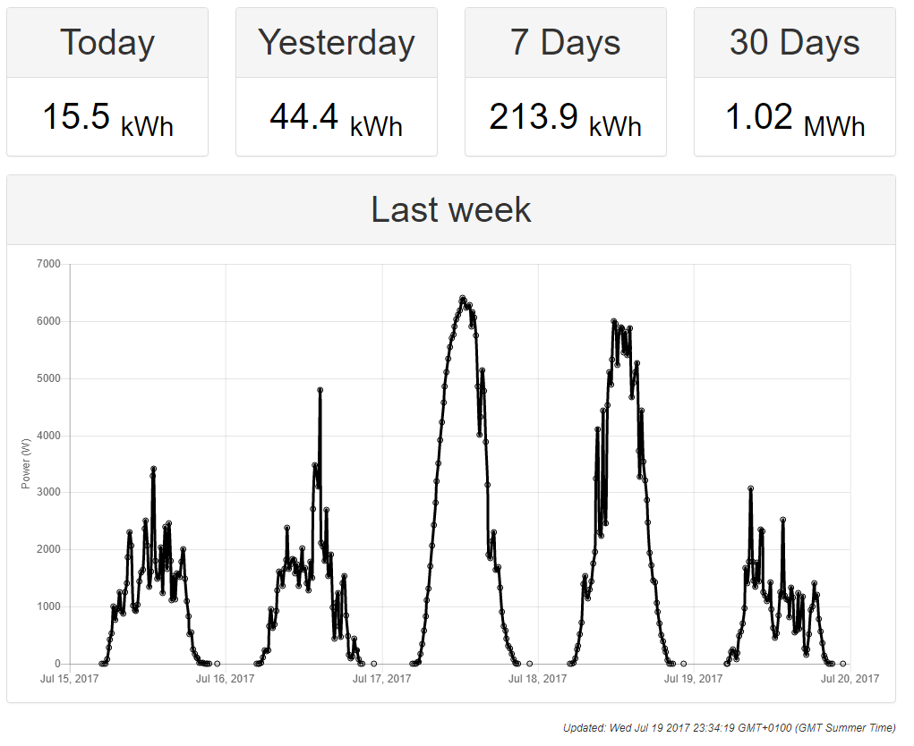
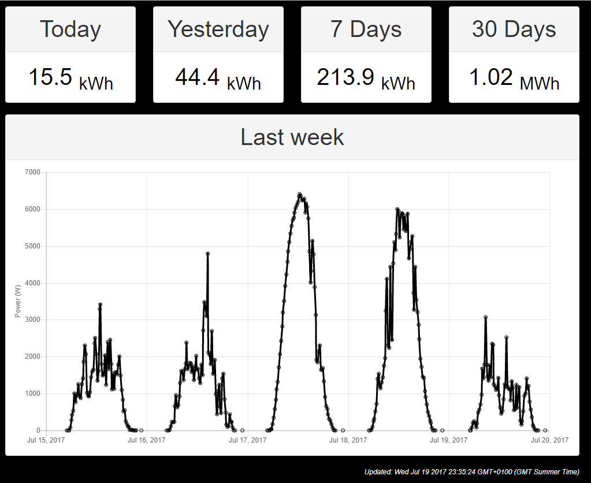

# SolarEdgeESign
Website to display data for a solar edge PV array on a planet e-sign display (as an embedded site) 
## Usage
Load `https://jbithell.github.io/SolarEdgeESign/index.html` in your browser passing `code` and `key` as get parameters.

`code` is your site code, a six digit number

`key` is your api key, a long alphanumeric string

### Display
`Today` the amount generated so far

`Yesterday` the amount generated in total yesterday

`7 Days` the amount generated in total over the last 7 days including today

`30 Days`  the amount generated in total over the last 30 days including today

`Last week` a graph of the last 5 days, including today, in 15 minute intervals - showing the power at that point (in Watts - not Watt hours)

### AutoUpdate
The data on the screen is refreshed every `30 minutes` (from the time it was first loaded), except between the hours of `9pm` and `6am` when updates are disabled to save API key quota usage (the data won't change during that time anyway - the sun has gone in!)

## Background Colour

This system supports screens with a black background - just pass `&black=true` as part of the URL

